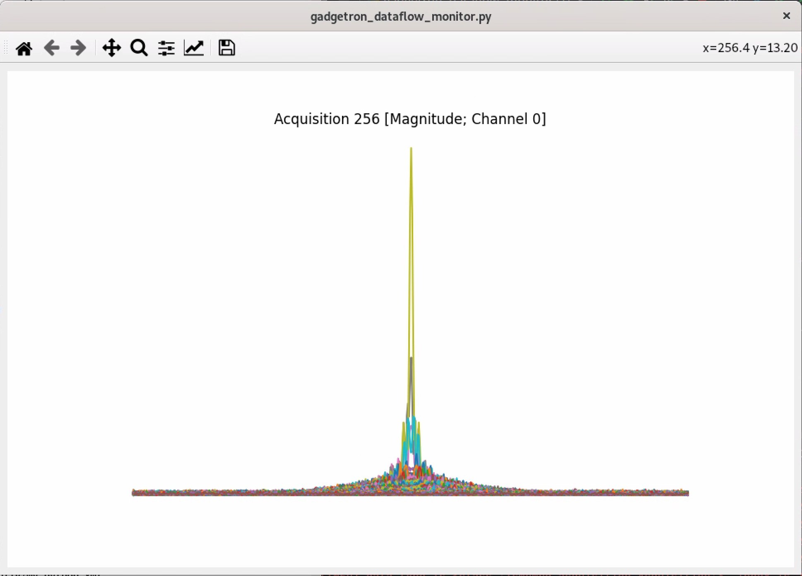

A Gadgetron Dataflow Monitor

A Gadgetron debugger tools by Python with QT plus matplotlib, with love by Cong Zhang

# 你好



# Quick Start

## Server side

```bash
#export PYTHONPATH=other_python_path_if_needed
gadgetron
```

## Tester side

```bash
gadgetron_ismrmrd_client -f test_datas/testdata.h5  -C use_in_gadgetron_sample/python_monitor_start_automate.xml
```

## Internal

1. [Core]A QT+Matplotlib UI application to show data
2. Data Producer run in a standalone Thread to produce data and send to UI by trigger signal
3. The core Application can be use under three ways:
    1. As a start by hand external application which listen to gadgetron stream data
    2. Use as data process gadget which start by gadgetron
    3. Use as normal Python UI application which read data from ismrmrd file
    
# TODO

1. fix the speed problem of realtime update
2. fix the initial focus problem(can not receive key event unless user click on canvas)?
3. add a sample to read data from testdata and show directly? [done]
4. rename and publish to pypi, project structure may need to adjust [wip]
5. add a screen gif to demo how to use ( use peek software )
6. CD by github action 

# References

1. https://matplotlib.org/stable/gallery/user_interfaces/embedding_in_qt_sgskip.html
2. https://github.com/gadgetron/GadgetronOnlineClass/blob/master/Courses/Day1/Lecture2/visualization/visualization.py
3. https://github.com/matplotlib/matplotlib/pull/19255
4. https://github.com/anntzer/matplotlib/tree/qt6

# Warning

This depend on new released Python with Qt 6, and unpublished mathplotlib with QT6 support!

